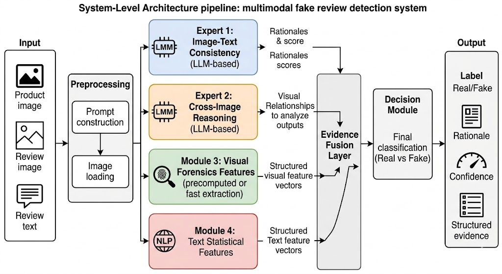
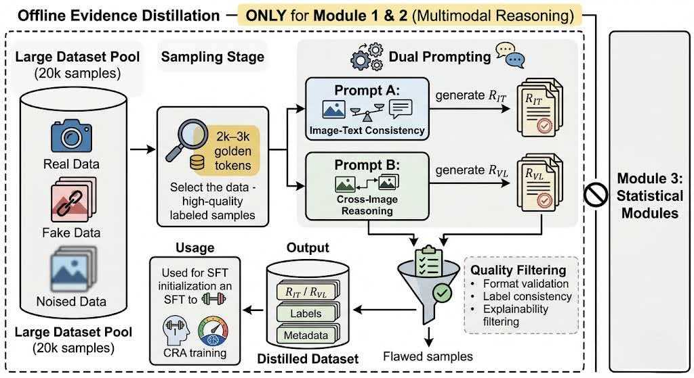

# AIGC_CLEAR

## 1. Project Layout

```text
AIGC_CLEAR/
  LICENSE
  README.md
  requirements.txt
  .gitignore
  checkpoints/
    .gitkeep
  experts/
    __init__.py
    common/
      __init__.py
      dataset.py
      io_utils.py
      phase2/
        __init__.py
        run_cra_loop.py
        train_dpo.py
        generate_rationale.py
        visual_calibrate.py
        collators.py
        evaluate.py
        eval_test50_checkpoints.py
        eval_test50_single_candidate.py
        utils.py
        visual_calibrate_v1_backup.py
    e_it/
      __init__.py
      train.py
      phase1/
        __init__.py
        build_seed_sft_dataset.py
        train_seed_sft.py
    e_vl/
      __init__.py
      train.py
      phase1/
        __init__.py
        build_seed_sft_dataset.py
        train_seed_sft.py
    e_ff/
      __init__.py
      train.py
    e_sl/
      __init__.py
      train.py
  web/
    app.py
    templates/
      index.html
      detect.html
      result.html
      api.html
      pricing.html
      dashboard.html
```

## 2. Expert Mapping

- E_IT: Image-Text Consistency expert training
- E_VL: Dual-Image Vision Logic expert training
- E_FF: Low-level Forensic Feature expert training prep
- E_SL: Statistical Language expert training prep

## 3. Checkpoint Placement (Important)

Place all training outputs under `checkpoints/` with one directory per expert and one sub-directory per run timestamp.
Please contact us to obtain the fine-tuned checkpoint.

```text
checkpoints/
  e_it/run_YYYYMMDD_HHMMSS/
    training_summary.json
    model/                 # optional, if you save model weights
  e_vl/run_YYYYMMDD_HHMMSS/
    training_summary.json
    model/
  e_ff/run_YYYYMMDD_HHMMSS/
    training_summary.json
    model/
  e_sl/run_YYYYMMDD_HHMMSS/
    training_summary.json
    model/
```

Rule of thumb:

- always save `training_summary.json`
- save weights under `model/` (or your preferred subfolder) for consistency


### System Architecture



### Expert Modules Overview



## 4. Setup

```bash
pip install -r requirements.txt
```

## 5. Run Expert Training Scripts

From the `AIGC_CLEAR` root:

```bash
python -m experts.e_it.train --dataset path/to/pair_samples.jsonl --output-dir checkpoints/e_it
python -m experts.e_vl.train --dataset path/to/pair_samples.jsonl --output-dir checkpoints/e_vl
python -m experts.e_ff.train --dataset path/to/pair_samples.jsonl --image-root path/to/images --output-dir checkpoints/e_ff
python -m experts.e_sl.train --dataset path/to/pair_samples.jsonl --output-dir checkpoints/e_sl
```

Each script creates:

- `checkpoints/<expert>/run_<timestamp>/training_summary.json`

## 6. Run Web Showcase

```bash
python web/app.py
```

Open:

- `http://127.0.0.1:5000`

Included endpoints:

- `GET /api/checkpoint_layout`: returns expected checkpoint folder layout
- `POST /api/mock_detect`: simple mock endpoint for UI demonstration

## 7. Run Migrated Pipelines

From the `AIGC_CLEAR` root:

```bash
# E_IT phase1 data build + seed SFT
python experts/e_it/phase1/build_seed_sft_dataset.py
python experts/e_it/phase1/train_seed_sft.py

# E_VL phase1 data build + seed SFT
python experts/e_vl/phase1/build_seed_sft_dataset.py
python experts/e_vl/phase1/train_seed_sft.py

# Shared phase2 CRA loop
python experts/common/phase2/run_cra_loop.py --input_path data/FakeReviewDataset/pair_samples.jsonl
```

## 8. Notes

- This version intentionally keeps only training-oriented code and web showcase code.
- Full inference pipeline can be added later by replacing the mock endpoint in `web/app.py`.

## 9. License

MIT License.
